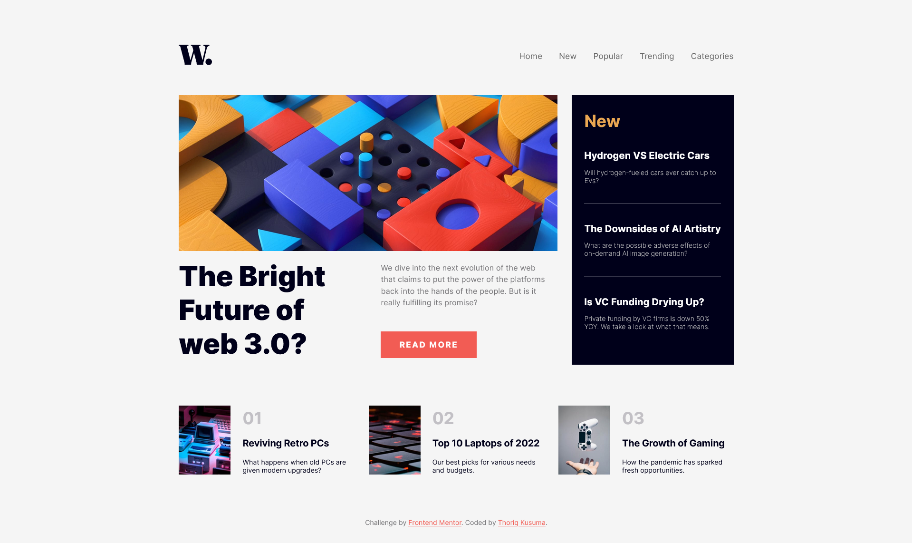

# Frontend Mentor - News homepage solution

This is a solution to the [News homepage challenge on Frontend Mentor](https://www.frontendmentor.io/challenges/news-homepage-H6SWTa1MFl). Frontend Mentor challenges help you improve your coding skills by building realistic projects. 

## Table of contents

- [Frontend Mentor - News homepage solution](#frontend-mentor---news-homepage-solution)
  - [Table of contents](#table-of-contents)
  - [Overview](#overview)
    - [The challenge](#the-challenge)
    - [Screenshot](#screenshot)
    - [Links](#links)
  - [My process](#my-process)
    - [Built with](#built-with)
    - [What I learned](#what-i-learned)
    - [Continued development](#continued-development)
  - [Author](#author)

## Overview

### The challenge

Users should be able to:

- View the optimal layout for the interface depending on their device's screen size
- See hover and focus states for all interactive elements on the page

### Screenshot

### Links

- Solution URL: [GitHub repo](https://your-solution-url.com)
- Live Site URL: [GitHub page](https://your-live-site-url.com)

## My process

### Built with

- Semantic HTML5 markup
- CSS custom properties
- Flexbox
- CSS Grid
- Mobile-first workflow
- [React](https://reactjs.org/) - JS library
- Typescript

### What I learned

In this project I learned about react, and also using typescript. There's a problem when I'm making the navbar and in this project I think it's still not very good because the responsiveness isn't that good.

### Continued development

In this project maybe in later I will continue to developt the responsiveness.

**Note: Delete this note and the content within this section and replace with your own plans for continued development.**

## Author

- Frontend Mentor - [@prmdtya](https://www.frontendmentor.io/profile/prmditya)
- GitHub - [prmditya](https://github.com/prmditya)